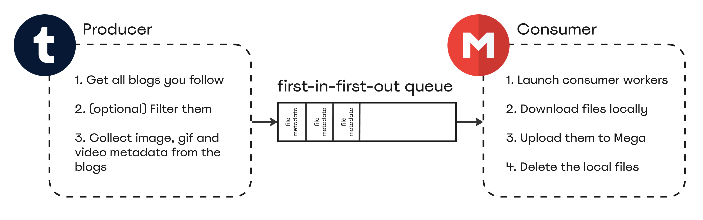

# art-collector

This project collects images, gifs and videos from blogs you follow on Tumblr and stores them either locally or on Mega.

## Problem Statement and Benefits
Scrolling through multiple artists' blogs with the sole intention of saving their art can be time-consuming and tiring, as feeds contain text and answer posts without any art, reposts of other artists' blogs and multiple posts containing the same image in a row. Rarely checking their feed may result in the question: 'Have I seen/saved this before?' Once an image has been saved, viewing "tumblr_648ba005d94d7df16db11515583f9747_2048.png" won't help to identify the artist's name. The only alternative is to manually rename each image, which would take even more time.

Have you ever experienced this? Great! The `art-collector` solves it all!

- All art is available in the highest resolution in a single folder, either locally or on Mega.
- All art has meaningful names, for example, "myfavouriteblog_cedar-waxwing_b24049936730f015cb82121a05cd6427.png". If a post contains multiple images, each one is saved with a unique suffix.
- No duplicate art! If two posts contain the same image with different URLs, the `art-collector` will collect it once.
- A lot of Quality of Life parameters (see below).
- Run the `art-collector` at any interval, it will remember the date and the blogs you followed. The next time it runs, it will not only collect new posts published after the saved date, but also check if you have followed any new blogs in the meantime and collect as many files as you want for them (see `TUMBLR_FILE_LIMIT_PER_BLOG`), ignoring the saved date.
- The `art-collector` is highly optimised with multithreading and queue. Speed will depend heavily on your Mbps. My personal benchmarks: 44 blogs and 2000 files totalling 2 GB finished in 6.5 minutes.

## Quality of Life

The `art-collector` has a few optional parameters that can be used to adjust the behaviour of the pipeline. These can be found in the `.env.template`.

### Filters
- `TUMBLR_COLLECT_VIDEOS` — set to False to prevent videos from being saved.
- `TUMBLR_BLOGS_TO_CRAWL` — a list of the blogs you follow that you want to extract. This is helpful if you follow many blogs but only want to crawl a couple of them.
- `TUMBLR_BLOGS_TO_IGNORE` — a list of the blogs you follow that the pipeline should skip. This is helpful if you follow many blogs but want to cherry-pick which ones to exclude from the collection.

### Limits
- `TUMBLR_FILE_LIMIT_PER_BLOG` — sets a limit on the number of files to be collected per blog. This prevents all files from being collected from old and large blogs. This parameter is applied to the first run and to new blogs that you follow.
- `LOCAL_FILE_SIZE_LIMIT_MB` — set a limit on how large a single file can be in megabytes. Consider increasing this limit if you expect to collect large videos.
- `MEGA_FOLDER_SIZE_LIMIT_MB` — set a limit on the amount of storage that all collected files can take up in megabytes. This is a helpful parameter for the Mega storage quota. This limit may be slightly exceeded due to the nature of multithreading.

### Save Locations
- `LOCAL_UPLOAD_PATH` — is used only if `SAVE_TO_MEGA` is set to False, must be a full local path.
- `MEGA_UPLOAD_PATH` — the path on MEGA where all the collected files should be saved.

## How to use it

- Clone this repo
  ```
  git clone git@github.com:MishchenkoYuriy/art-collector.git
  ```
- Create and activate a virtual environment
- Install dependencies
  ```
  pip install -r requirements.txt
  ```
- Rename `.env.template` to `.env`

- Tumblr:
    - Login to your Tumblr account, go to https://www.tumblr.com/oauth/apps and click "Register the app"
    - Save OAuth Consumer Key as `TUMBLR_CONSUMER_KEY`
    - Click "Show secret key", save Secret Key as `TUMBLR_CONSUMER_SECRET`
    - Go to https://api.tumblr.com/console/calls/user/info, allow the app to read
    - Click on "JAVASCRIPT", from the code snippet copy token as `TUMBLR_OAUTH_TOKEN` and token_secret as `TUMBLR_OAUTH_SECRET`

- Mega:
    - If you prefer to save files locally, set `SAVE_TO_MEGA` to False and fill in `LOCAL_UPLOAD_PATH`. Otherwise follow these steps:
    - Download https://mega.io/cmd
    - Add MEGA CMD to your PATH, for MacOS:
      ```
      export PATH=/Applications/MEGAcmd.app/Contents/MacOS:$PATH
      ```
    - Fill in `MEGA_EMAIL` and `MEGA_PASSWORD`
    - If you are using two-factor authentication (2FA), open your authentication app and be ready to copy the code to `MEGA_AUTH_CODE` immediately before running the last command.

- Fill in the optional parameters (see "Quality of Life" above)

- Run
  ```
  python scripts/pipeline.py
  ```

## Architecture

<p align="center">

</p>

The project uses `concurrent.futures.ThreadPoolExecutor` and `queue` modules to enable multiple consumer workers to process files as soon as Tumblr returns their metadata. The correct metadata format is ensured by `pydantic.BaseModel`.
